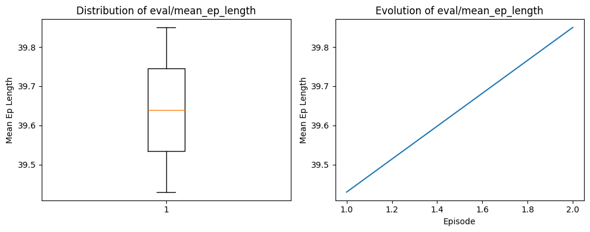
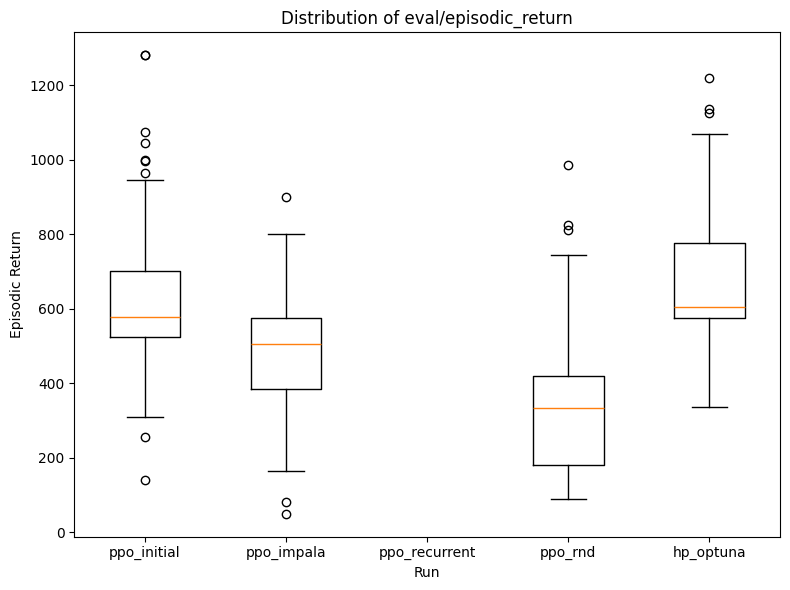
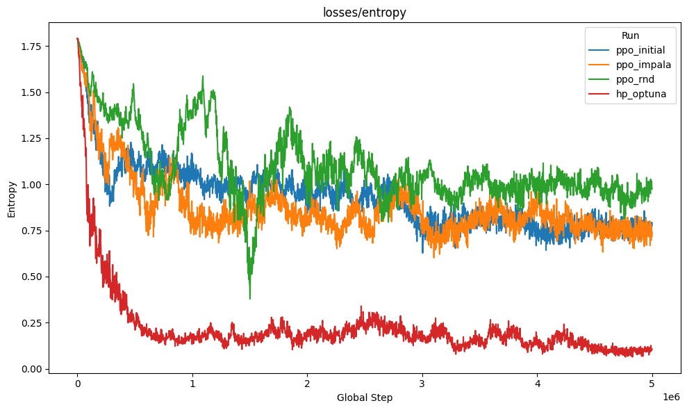

# Bericht

Alle Ergebnisse und Analysen, welche nicht im Detail beschriben sind, können in den jupyternotebooks angeschaut werden.
`Eval_metrics.ipynb` enthält alle einzelnen Evaluationen der Agenten und `eval_metric_all.ipynb` enthält die vergleiche zu den anderen Agenten.

## Baseline
Als Baseline dienen zwei sehr unterschiedliche Ansätze, die keine echten Lernkomponenten enthalten, aber wertvolle Orientierungspunkte liefern:

Der RandomAgent wählt bei jedem Schritt zufällig eine Aktion aus dem diskreten Aktionsraum von Space Invaders. Diese „Dummybaseline“ zeigt, welchen Durchschnitts-Score man ohne jegliche Strategie erzielt und dient dazu, den minimal erwartbaren Reward zu definieren. Ich erwarte über 100 Evaluationsepisoden nur sehr niedrige Punktzahlen und sehr kurze Episodenlängen, da er keine zielgerichteten Schüsse abgibt und keine Positionierungsvorteile nutzt.

Demgegenüber steht der HeuristicAgent, ein einfacher regelbasierter Agent, der stets gleichzeitig schiesst (FIRE) und sich abwechselnd für jeweils eine feste Anzahl von Frames nach links oder rechts bewegt. Technisch wird hierzu bei jedem Schritt die Aktion RIGHTFIRE oder LEFTFIRE ausgewählt und nach einer vordefinierten Anzahl von Schritten (bounce_steps) die Bewegungsrichtung invertiert. Diese Heuristik sorgt zumindest dafür, dass der Agent kontinuierlich feuert und das Raumschiff in Bewegung bleibt, wodurch er deutlich höhere Punktzahlen erreicht als der RandomAgent, aber natürlich immer noch weit von lernenden Algorithmen entfernt ist.

Beide Baselines werden über jeweils 100 Episoden evaluiert, wobei neben dem kumulierten Reward auch die Episodenlänge und die Laufzeit gemessen werden. So erhält man nicht nur einen Vergleich auf Basis des Scores, sondern auch Einsichten in Stabilität und Effizienz – wichtige Referenzwerte für alle folgenden, lernbasierten Agenten.

Ich habe bewusst 2 Baselines gewählt, um ein breites Spektrum an Vergleichswerten zu erhalten: Der RandomAgent zeigt die untere Grenze des Möglichen, während der HeuristicAgent eine einfache, aber effektive Strategie demonstriert. Beide liefern wertvolle Orientierungspunkte für die Bewertung der späteren lernenden Agenten.

### Ergebnisse des HeuristicAgent

Der heuristische Agent erzielt einen durchschnittlichen `Episodic return` von ca. `265` und eine Standartabweichung von  ca. `105`.
### Ergebnisse des RandomAgent

Der random Agent erzielt einen durchschnittlichen `Episodic return` von ca. `146` und eine Standartabweichung von  ca. `106`.

### Zusammenfassung der Baseline-Ergebnisse
Der heuristische Agent liefert mit einer Mittelrendite von ≈265 gegenüber ≈146 des Zufallagents schon einen deutlichen Performancesprung.
Beide Agenten haben grosse Varianz (Std ≈105). Die Ausreisser nach oben zeigen, dass beiden Agenten gelegentlich Glück haben, aber nicht konsistent.
## initialer Ansatz

Für den Initialen Ansatz habe ich PPO (proximal policy optimization) gewählt. Bei PPO kommen zwei Komponenten zum Einsatz: der „Actor“, der die Policy direkt optimiert, und der „Critic“, der den erwarteten Wert über eine Advantage-Funktion schätzt. So verbindet PPO die Stärke von Policy- und Value-Methoden in einem stabilen Lernverfahren.

Ich habe mich für PPO entschieden, weil dies auch verwendet wird, um CHatGPT zu trainieren. Auch im Paper "Deep Q-Learning versus Proximal Policy
Optimization" (https://ieeexplore.ieee.org/stamp/stamp.jsp?tp=&arnumber=10228056) wird gezeigt, dass PPO in vielen Umgebungen eine bessere Leistung erbringt als DQN.
### Wrapper
| Wrapper                                | Konfiguration                                                          |
| -------------------------------------- | ---------------------------------------------------------------------- |
| `gym.wrappers.RecordVideo`             | `f"videos/{run_name}"`, `render_mode="rgb_array"` (nur für `idx == 0`) |
| `gym.wrappers.RecordEpisodeStatistics` | —                                                                      |
| `NoopResetEnv`                         | `noop_max=30`                                                          |
| `MaxAndSkipEnv`                        | `skip=args.skip_frames`                                                |
| `EpisodicLifeEnv`                      | —                                                                      |
| `FireResetEnv`                         | — (wenn `"FIRE"` in `env.unwrapped.get_action_meanings()`)             |
| `ClipRewardEnv`                        | —                                                                      |
| `gym.wrappers.ResizeObservation`       | `shape=(84, 84)`                                                       |
| `gym.wrappers.GrayscaleObservation`    | —                                                                      |
| `gym.wrappers.FrameStackObservation`   | `num_stack=4`                                                          |

### Hyperparameter
| Hyperparameter       | Wert                                       | Beschreibung                                                                                                                             |
| -------------------- | ------------------------------------------ |------------------------------------------------------------------------------------------------------------------------------------------|
| exp\_name            | `os.path.basename(__file__)[:-len(".py")]` | name des experiment                                                                                                                      |
| seed                 | 1                                          | seed                                                                                                                                     |
| env\_id              | `"ALE/SpaceInvaders-v5"`                   | Umgebung indem der Agent trainiert wird                                                                                                  |
| eval\_episodes       | 100                                        | Anzahl der Episoden für die Evaluation des Agenten                                                                                       |
| wandb\_tracking      | true                                       | WandB-Tracking aktivieren                                                                                                                |
| wandb\_proj          | `"rle-initial"`                            | Name des WandB-Projekts                                                                                                                  |
| wandb\_entity        | null                                       | Name der WandB-Entity (optional)                                                                                                         |
| video                | true                                       | Videos speichern                                                                                                                         |
| torch\_deterministic | true                                       | PyTorch deterministisch                                                                                                                  |
| cuda                 | true                                       | CUDA verwendet werden soll                                                                                                               |
| save\_model          | true                                       | Model speichern                                                                                                                          |
| eval\_checkpoint     | null                                       | Pfad zum gespeicherten Modell für die Evaluation (optional)                                                                              |
| total\_timesteps     | 5\_000\_000                                | Gesamte Anzahl der Trainingsschritte (Frames)                                                                                            |
| lr                   | 2.5e-4                                     | Lernrate für den Optimierer (Adam)                                                                                                       |
| num\_envs            | 16                                         | Anzahl der parallelen Umgebungen                                                                                                         |
| num\_steps           | 128                                        | Anzahl der Schritte pro Update (Rollout-Länge)                                                                                           |
| anneal\_lr           | true                                       | Lernrate anpassen (annealing)                                                                                                            |
| gamma                | 0.99                                       | Discount-Faktor für zukünftige Rewards                                                                                                   |
| gae\_lambda          | 0.95                                       | Lambda für Generalized Advantage Estimation (GAE)                                                                                        |
| num\_minibatches     | 4                                          | Anzahl der Mini-Batches pro Update                                                                                                       |
| update\_epochs       | 4                                          | Anzahl der Update-Epochen pro Mini-Batch                                                                                                 |
| norm\_adv            | true                                       | Advantage normalisieren                                                                                                                  |
| clip\_coef           | 0.1                                        | Clipping-Koeffizient für die Policy-Gradient-Berechnung                                                                                  |
| clip\_vloss          | true                                       | Clipping der Value-Loss-Berechnung                                                                                                       |
| ent\_coef            | 0.01                                       | Koeffizient für den Entropie-Bonus zur Förderung der Exploration                                                                         |
| vf\_coef             | 0.5                                        | Koeffizient für den Value-Loss                                                                                                           |
| max\_grad\_norm      | 0.5                                        | Maximale Gradienten-Norm für Gradient Clipping                                                                                           |
| target\_kl           | null                                       | Ziel-KL-Divergenz für die Policy-Optimierung (optional)                                                                                  |
| skip\_frames         | 4                                          | Anzahl der Frames, die übersprungen werden, um die Aktion zu wählen                                                                      |
| batch\_size          | 0                                          | Batchgrösse für die Optimierung (0 da Batchgrösse automatisch durch num_envs und num_steps berechnet)                                    |
| minibatch\_size      | 0                                          | Grösse der Mini-Batches für die Optimierung (0 da Mini-Batch-Grösse automatisch durch num_envs, num_steps und num_minibatches berechnet) |
| num\_iterations      | 0                                          | Anzahl der Iterationen für die Optimierung (0 da automatisch durch total_timesteps, num_envs und num_steps berechnet)                    |

### Agent
Der Agent in diesem Script besteht aus einem kleinen, konvolutionalen Neuronalen Netzwerk, das drei aufeinanderfolgende Conv2D-Schichten mit jeweils ReLU-Aktivierung einsetzt (Filtergrössen 8×8 mit Stride 4, 4×4 mit Stride 2 und 3×3 mit Stride 1),
gefolgt von einem Flattening und einer voll verbundenen Schicht mit 512 Einheiten. Auf diesen gemeinsamen Repräsentationskopf bauen zwei separate Köpfe auf: Der Actor ist eine lineare Schicht, die auf der 512-dimensionalen Repräsentation die Aktionslogits erzeugt und daraus eine kategoriale Verteilung konstruiert,
um Aktionen zu sampeln. Der Critic ist ebenfalls eine lineare Schicht, die einen einzigen Wert (State-Value) vorhersagt.
Alle linearen und Faltungs-Layer werden orthogonal initialisiert, um stabiles Lernen zu fördern. Während der Interaktion normalisiert das Netzwerk die Eingabebilder durch Division durch 255, um Werte im Bereich [0,1] zu erhalten.

### Ergebnisse

#### Episodenlänge
| Ansatz    | Mittelwert | Standartabweichung |
|-----------|------------|--------------------|
| Initial   | 942.54     | 249.97             |
| heuristic | 663.00     | 182.94             |
| random    | 535.56     | 169.96             |

(plot1: initial,plot2: heuristic, plot3: random)

Der trainierte Agent erreicht mit im Schnitt 942 Schritten pro Episode eine deutlich längere Lebensdauer als die Heuristik (663) und die zufällige Politik (536). Die grössere Standardabweichung (≈250) und die Ausreisser bis über 1 600 Schritte deuten darauf hin, dass das Modell in vielen, aber nicht allen Fällen sehr robust agiert und gelegentlich aussergewöhnlich lange durchs Spiel kommt. Die Heuristik bleibt mit moderater Variabilität (σ≈183) im Mittelfeld, während Random mit σ≈170 am wenigsten konsistent ist.

#### Episodic Return
| Ansatz    | Mittelwert | Standartabweichung |
|-----------|------------|--------------------|
| Initial   | 616.65     | 188.92             |
| heuristic | 265.40     | 105.05             |
| random    | 146.60     | 106.41             |

(plot1: initial,plot2: heuristic, plot3: random)

Bei der kumulierten Belohnung glänzt der gelernte Agent mit durchschnittlich 617 Punkten, das sind fast dreimal so viele wie die Heuristik (265) und noch mehr gegenüber Random (147). Auch hier zeigt der Agent die grösste Streuung in den Returns (σ≈250), was darauf hindeutet, dass er zwar oft sehr hohe Punktzahlen erzielt, gelegentlich aber auch unterdurchschnittlich abschneidet. Heuristik und Random liefern vergleichsweise schmalere Verteilungen und niedrigere Maxima.

#### Episodic Time
| Ansatz    | Mittelwert | Standartabweichung |
|-----------|------------|--------------------|
| Initial   | 0.61       | 0.16               |
| heuristic | 0.68       | 0.22               |
| random    | 0.59       | 0.19               |

(plot1: initial,plot2: heuristic, plot3: random)

Die Ausführungszeit pro Episode liegt beim Agenten bei etwa 0,61 s, was nur minimal langsamer ist als Random (0,59 s) und sogar etwas flotter als die Heuristik (0,68 s). Die geringe Varianz in den Laufzeiten (Agent σ≈0,16 s, Heuristik σ≈0,22 s, Random σ≈0,19 s) zeigt, dass die zusätzliche Netzwerkinferenz nur einen sehr moderaten Overhead verursacht und der Agent insgesamt sehr effizient arbeitet.

## Experimentelles Setup und Evaluations-Rezept:
**Gesamtzahl der Timesteps**
Es werden immer insgesamt 5'000'000 Interaktionsschritte mit der Umgebung durchgeführt (total_timesteps = 5_000_000).

**Gesamtzahl der evaluations Episoden**
Es werden immer 100 Episoden für die Evaluation des Agenten verwendet (eval_episodes = 100).

**Parallele Umgebungen**
Es kommen 16 parallele Rollout-Environments zum Einsatz (num_envs = 16), um Trajektorien effizient im Batch zu sammeln.

*Frame Skip (MaxAndSkipEnv)*
Jeder Agent überspringt 4 Frames pro Aktion (skip_frames = 4), d.h. die gewählte Aktion wird für 4 aufeinanderfolgende Frames ausgeführt und nur das Maximum der gerenderten Frames weiterverarbeitet.

*No-Op Resets*
Bis zu 30 No-Op-Aktionen werden zufällig zu Beginn einer Episode eingestreut (noop_max = 30), um die Startzustände zu diversifizieren.

*Episodic Life*
Über den Wrapper EpisodicLifeEnv wird jeder Verlust eines Lebens als Episode-Ende behandelt, um das Lernen robuster zu machen.

*Fire Reset*
Falls die Umgebung eine „FIRE“-Aktion benötigt (z. B. bei Breakout), wird vor dem eigentlichen Start automatisch diese Aktion ausgeführt.

*Reward Clipping*
Die extrinsische Belohnung wird mit ClipRewardEnv auf die Werte −1,+1−1,+1 beschränkt, um Ausreisser zu dämpfen.

*Vorverarbeitung des Beobachtungsraums*

- Resize auf 84 × 84 Pixel
- Graustufen-Konvertierung
- Frame Stacking: Vier aufeinanderfolgende Graustufen-Frames werden zu einem einzigen Beobachtungsvektor zusammengefasst.

## Erweiterungen   

Ich habe mich für folgende 4 Erweiterungen entschieden, um die Leistung des PPO-Agenten (hoffentlich) zu verbessern:
- IMPALA-CNN-Backbone
- Recurrent PPO (LSTM)
- Random Network Distillation (RND)
- Hyperparameter-Optimierung mit Optuna

Die Entscheidung für diese Erweiterungen basieren auf Nachforschungen im Web und Vorschläge von KI-Tools.

### IMPALA-CNN-Backbone
Ersetzt das kleine CNN durch ein dreistufiges IMPALA-ResNet. Hier wird keine layer initialisierung gemacht,
da torch mit kaiming he (relu) initialisiert. Das IMPALA-Backbone hat Residualverbindungen und Max-Pooling, dadurch verteilt sich der Gradient besser,
sodass die Vorteile einer expliziten Orthogonal init hier geringer ausfallen.
#### Hypothese
Dreistufige Residual-ähnliche Convolutional-Blöcke mit Pooling sollten reichhaltigere und hierarchischere Features
extrahieren als das schmalere Classic-CNN. Ich erwartete dadurch schnellere Konvergenz und eine robustere Repräsentation,
die höhere mittlere Return-Werte in SpaceInvaders ermöglicht.
#### Parameter / änderungen

Die Paramter bleiben die gleichen wie im initialen Ansatz. Der Agent hingegen hat sich geändert.
Der Impala-Agent nutzt das modulare IMPALA-Block-Design (je zwei 3×3-Convs + Pool), um, mit weniger Kanälen, tiefer zu stapeln und am Ende auf 256 Feature-Dimension zu reduzieren.
Für die Initialisierung wird hier kein orthogonales Initialisieren verwendet, da PyTorch standardmässig Kaiming-He-Initialisierung für ReLU nutzt.
Der Impala-Agent ist also schlanker, lässt sich tiefer stapeln und profitiert von der IMPALA-Block-Modularität.

#### evaluation der Ergebnisse
| Ansatz   | Mittelwert | Standartabweichung |
|----------|------------|--------------------|
| impala   | 489.50     | 165.67             |
| Initial  | 616.65     | 188.92             |

(plot1: impala, plot2: initial)

Die Visualisierung der Episodenlängen und Episodenzeiten, werden dann am Schluss mit allen anderen Agenten verglichen.

#### Analyse

Im Vergleich zum ursprünglichen („Initial“) PPO-Ansatz liefert Impala deutlich geringere mittlere Episoden-Renditen (≈ 490 vs. 617) und erreicht auch in seinen Quartilen und Maxima nicht das Niveau des Initial-Modells. Gleichzeitig ist die Streuung bei Impala mit σ≈ 166 etwas geringer als beim Initial-Ansatz (σ≈ 189), das heisst, Impala agiert zwar konsistenter, bleibt aber unterdurchschnittlich in der Performance. Die Boxplots zeigen, dass selbst die oberen Ausreisser von Impala (≈ 900–950 Punkte) nicht an die Spitzenwerte des Initial-Agents (über 1 200 Punkte) heranreichen.

Schlussfolgerung: Der initial trainierte PPO-Agent erzielt nicht nur höhere durchschnittliche Belohnungen, sondern vereint auch Höhen (Outlier) und Tiefen (untere Quartile) in einer grösseren Bandbreite – was auf eine insgesamt stärkere Policy hinweist. Impala wirkt stabiler, bringt aber im aktuellen Setup keinen Performance-Vorteil.

### Recurrent PPO (LSTM)

#### Hypothese
Ein R-PPO-Agent kann aus der Historie eine latent-State-Schätzung bilden. Durch Hinzufügen eines LSTM-Layers hinter dem
Feature-Extractor sollte der Agent ein Gedächtnis für zeitlich entfernte Abhängigkeiten geben.
Ich erwarte signifikanten Reward-Zuwachs in Umgebungen, in denen die letzte Observation allein nicht ausreicht, 
um optimale Aktionen zu wählen. Gerade in Enviroments mit teilweiser Beobachtbarkeit (z. B. Bewegungsmuster der Gegner)
könnte das Langzeitgedächtnis zu stabileren, strategischeren Entscheidungen und besseren Return-Werten führen.

#### Parameter / änderungen
Diese Methode hat nicht nur ein Architektur-Parameter-Tweak (wie IMPALA-CNN), sondern auch anderer Rechen-Graph (hidden state, sequence batching, …).
in diesem Recurrent-Ansatz wechsle ich von einer selbstgebauten PPO-Implementierung hin zu RecurrentPPO aus SB3-Contrib, integriere eine LSTM-Policy mit modularen Impala-Blocks,
reduziere die Anzahl der Umgebungen für die Zustandsverwaltung des RNN, und nutze SB3-Callbacks statt manueller Trainings- und Evaluations-Loops.

| Parameter        | initial | Recurrent PPO |
|------------------|---------|---------------|
| num_envs         | 16      | 4             |
| num_steps        | 128     | 128           |
| n_epochs         | -       | 2             |
| clip_range       | -       | 0.2           |
| lstm_hidden_size | -       | 64            |

Es gibt weitere Parameter, die ich nicht verwendet habe, da sie in der RecurrentPPO-Implementierung von SB3-Contrib bereits optimiert sind.

#### evaluation der Ergebnisse

Leider ist mir bei der Evaluation ein Fehler unterlaufen, weshalb ich die Episodenlängen und Returns und times nicht korrekt messen konnte.
Zusätzlich fehlt mir die Zeit die Evaluation zu wiederholen, weshalb ich die Evaluation nicht erneut durchgeführt habe. Das Modell die Evaluation und der Run sind abgelegt.
Die Metrik mean_ep_length stimmt leider nicht mit den anderen Episodenlängen überein, so kann ich leider keine Vergleichswerte zu den anderen Agenten liefern.

#### Analyse
Diese Erweiterung müsste nocheinmal evaluiert werden, bevor sie richtig analysiert werden kann.

### Random Network Distillation (RND)
Als dritte Erweiterung füge ich RND-Bonus als additive Reward-Komponente ein. Es sollte Sparse-Reward-Probleme mindern und
erhöht Policy-Entdeckung neuer States.
#### Hypothese
Die intrinsische Belohnung aus der Prädiktor-Fehler-Signalbibliothek zielt darauf ab, Neugier zu fördern und selten besuchte
Zustände häufiger zu erkunden. Ich erwartete, dass der Agent so aus seiner Exploitation-Schleife ausbricht,
neue Taktiken entdeckt und insgesamt höhere extrinsische Return-Werte erzielt, insbesondere in Phasen mit spärlichem 
Umgebungs-Reward.
#### Parameter / änderungen
Der Agent wurde um ein Random-Network-Distillation-Modul erweitert. Zusätzlich zum gemeinsamen CNN-Backbone und den klassischen actor- und extrinsic critic-Heads
(jeweils 512 Hidden) gibt es nun einen separaten intrinsic critic sowie zwei RND-Netzwerke, ein festes Zielnetzwerk und einen lernbaren Prädiktor,
um über die MSE-Abweichung intrinsische Belohnungen zu generieren. Die Loss-Funktion kombiniert nun Policy- und Value-Loss mit einem gewichteten Predictor-Loss (`predictor_coef = 10.0`) und einem Intrinsic-Reward-Koeffizienten (`int_coef = 1.0`),
während alle bisherigen Hyperparameter wie `lr = 2.5e-4`, `num_envs = 16`, `num_steps = 128`, `clip_coef = 0.1` etc. unverändert übernommen wurden.
Zur Stabilisierung der intrinsischen Belohnung wird eine RunningMeanStd-Klasse genutzt.

| Parameter      | initial | RND   |
|----------------|---------|-------|
| int_coef       | -       | 1.0   |
| predictor_coef | -       | 10.0  |

#### evaluation der Ergebnisse
| Ansatz   | Mittelwert | Standartabweichung |
|----------|------------|--------------------|
| RND      | 341.75     | 185.77             |
| Initial  | 616.65     | 188.92             |

(plot1: rnd, plot2: initial)

#### Analyse
Obwohl RND theoretisch die Neugier schürt und selten besuchte Zustände belohnt, führt die zusätzliche intrinsische Komponente hier zu einer deutlich geringeren extrinsischen Performance. Die mittlere Episodenrendite sinkt von rund 617 Punkten im Initial-Setup auf lediglich etwa 342 Punkte mit RND, und auch die Ausreisser-Spitzen bleiben weit hinter denen des reinen PPO zurück. Die Varianz der Returns bleibt dabei fast unverändert hoch, was darauf hindeutet, dass der Agent zwar weiterhin gelegentlich gute Scores erzielt, insgesamt aber häufiger in uninteressante oder unertragreiche Regionen des Zustandsraums abdriftet.

Die RND-Belohnung hat zwar die Exploration verstärkt, konnte im Atari-Setting von Space Invaders allerdings nicht gezielt jene Spielstrategien fördern, die hohe Punktzahlen generieren. In diesem Fall scheint der ungesteuerte Neugier-Bonus eher vom effektiven Ausnutzen bekannter, lohnender Taktiken abzulenken, anstatt die extrinsische Return-Performance zu verbessern.

### Hyperparameter-Optimierung mit Optuna
Bayesian Search auf LR, n_steps, clip-range, λ u. a.
Automatisches Auffinden gut abgestimmter HPs liefert oft schnellere Konvergenz und bessere Ergebnisse als manuelles Tuning.
Deshalb habe ich Optuna für die vierte Erweiterung gewählt.

#### Hypothese
Durch die systematische Suche (Bayesian/TPE-Sampler) erwartete ich, wesentlich besser abgestimmte Lernraten, 
Mini-Batch-Grössen und Clip-Koeffizienten zu finden als durch manuelles Raten.
Das sollte die Stichprobeneffizienz steigern und das Risiko suboptimaler Konfigurationen minimieren. Insbesondere bei "nur" 5 Mio. Frames Trainingsbudget.
#### Parameter / änderungen
Der Agent bleibt gleich wie im initialen Ansatz, aber die Hyperparameter werden durch Optuna optimiert.

**Folgende Hyperparameter wurden optimiert:**

| Hyperparameter | Wertebereich           |
|----------------|------------------------|
| lr             | [1e-5, 5e-4] (log)     |
| num_steps      | [64, 128, 256]         |
| clip_coef      | [0.05, 0.3]            |
| gae_lambda     | [0.8, 0.99]            |
| ent_coef       | [0.0, 0.02]            |
| vf_coef        | [0.2, 1.0]             |

**Optuna Parameter:**

| Parameter      | Wert                       |
|----------------|----------------------------|
| n_trials       | 32                       * | 
| study_name     | "ppo_spaceinvaders"        |
| storage        | None                       |
| load_if_exists | True                       |
| sampler        | TPESampler(seed=args.seed) |
| pruner         | MedianPruner()             |

\* Wegen langer Trainingszeit wurde die Anzahl der Trials auf 32 begrenzt.

** Unterschiedde zum initialen Ansatz:**

| Hyperparameter        | initial   | Optuna                |
|-----------------------|-----------|-----------------------|
| eval_episodes         | 100       | 10 (HP-Search)      * |
| total_timesteps       | 5_000_000 | 100_000 (HP-Search) * |

\* Die Anzahl der Evaluations-Episoden wurde auf 10 reduziert, um die Sucheffizienz zu erhöhen. Die Gesamtzahl der Trainingsschritte wurde auf 100_000 reduziert, da die Traingszeiten sonst zu lange wären.

**Für das letzte Training wurden dann die besten Hyperparamter ausgewählt und mit 5_000_000 Timesteps trainiert und 100 Episoden evauliert.**
Somit ist ein Vergleich mit den anderen Agenten möglich.

#### Evaluation der Ergebnisse
| Ansatz    | Mittelwert  | Standartabweichung |
|-----------|-------------|--------------------|
| Optuna    | 676.000     | 172.46             |
| Initial   | 616.65      | 188.92             |

(plot1: optuna, plot2: initial)

#### Analyse
Im Vergleich zum initialen, manuell getunten Ansatz hat sich gezeigt, dass die Optuna-gestützte Hyperparameter-Optimierung nicht nur zu einem deutlich höheren Durchschnittsscore (676 vs. 616) führt, sondern gleichzeitig die Performance-Varianz reduziert und somit konsistentere Ergebnisse liefert. Dabei erweist sich insbesondere die systematische Feinabstimmung von Lernrate und Clip-Koeffizient als Schlüssel für eine verbesserte Balance zwischen stabiler Policy-Aktualisierung und effizientem Lernen. Obwohl das Trial-Budget mit 32 Läufen und jeweils nur 100 000 Trainingsschritten überschaubar war, hat sich dieser Mehraufwand schnell amortisiert: Schon in frühen Phasen des Trainings sind höhere Scores zu beobachten, was im produktiven Einsatz wertvolle Rechenzeit spart. Gleichzeitig bleibt der Gesamtaufwand wesentlich geringer, als wenn man dieselben Verbesserungen durch mehrfaches Volltraining ohne Hyperparameter-Suche erzielen wollte. Natürlich hängt der Erfolg stark von der sinnvollen Eingrenzung des Suchraums ab, und zusätzliche Trials könnten weiteres Potenzial heben, doch zeigen die vorliegenden Ergebnisse deutlich, dass selbst mit begrenztem Budget eine bayesianische Optimierung substanziell bessere RL-Agenten liefert. Insgesamt empfiehlt es sich daher, Hyperparameter-Suche nicht erst als Feintuning, sondern von Beginn an als integralen Bestandteil der Entwicklung zu planen, um sowohl die Stichprobeneffizienz zu maximieren als auch die Konvergenzgeschwindigkeit zu erhöhen.

## Finaler Vergleich
Hier werden die Ergebnisse aller Agenten zusammengefasst und verglichen. Die Plots zeigen die Episodenlängen, Returns und Laufzeiten für alle Agenten, einschliesslich der Baselines.

| Ansatz    | Episodenlänge (Mittelwert) | Episodenlänge (Std) | Episodic Return (Mittelwert) | Episodic Return (Std) | Episodenzeit (Mittelwert) | Episodenzeit (Std) |
|-----------|----------------------------|---------------------|------------------------------|-----------------------|---------------------------|--------------------|
| Random    | 535.56                     | 169.96              | 146.60                       | 106.41                | 0.59                      | 0.19               |
| Heuristic | 663.00                     | 182.94              | 265.40                       | 105.05                | 0.68                      | 0.22               |
| Initial   | 942.54                     | 249.97              | 616.65                       | 188.92                | 0.62                      | 0.16               |
| Impala    | 845.21                     | 194.82              | 489.50                       | 165.67                | 0.54                      | 0.12               |
| Recurrent | TODO                       | TODO                | TODO                         | TODO                  | TODO                      | TODO               |
| RND       | 1557.63                    | 284.47              | 341.75                       | 185.78                | 0.97                      | 0.17               |
| Optuna    | 971.57                     | 207.96              | 676.00                       | 172.46                | 0.56                      | 0.13               |

Die durchgeführten Experimente zeigen eindeutig, dass ein lernbasierter PPO-Agent die beiden einfachen Baselines (RandomAgent und HeuristicAgent) in allen Kennzahlen deutlich übertrifft. Der initiale PPO-Ansatz erreicht im Mittel eine Episodenlänge von ≈ 943 Schritten und einen kumulierten Reward von ≈ 617, was nahezu das Dreifache des RandomAgents (≈ 147) und mehr als das Doppelte des HeuristicAgents (≈ 265) ist. Gleichzeitig bleibt der Inferenz-Overhead mit ≈ 0,61 s pro Episode verhältnismässig gering und liegt nur minimal über dem des RandomAgents.

Unter den vier Erweiterungen schlägt sich das IMPALA-CNN-Backbone zwar mit etwas geringerer Varianz, erreicht aber weder höhere Returns noch übertrifft es das ursprüngliche PPO-Modell. Random Network Distillation (RND) verbessert die Exploration, führt aber zu einer deutlichen Verschlechterung des extrinsischen Rewards (≈ 342 vs. 617). Am besten verhält sich die Optuna-basierte Hyperparameter-Optimierung: Mit einem Mittel-Score von ≈ 676 und reduzierter Streuung erreicht der optimierte PPO-Agent die beste Balance aus stabiler Lernrate, effizientem Clip-Coef und angepasster Batch-Grössse.

Im obigen Plot sind die Episodischen Returns aller Agenten dargestellt. Hier zeigt sich noch grafisch, dass der Optuna-optimierte Agent die höchste mittlere Episodenrendite erzielt.

Der Plot zeigt die Entwicklung des Losses und der Entropie während des Trainings. Bei der Optuna Methode sinkt der Loss kontinuierlich, was auf eine erfolgreiche Optimierung der Policy hindeutet kann.

## Fazit

Ich konnte mit einem Ansatz, dem Optuna-optimierrten Agenten, das initiale modell schlagen. Leider nur leicht. Wenn ich noch mehr Zeit hätte, würde ich nun 
die Erweiterungen noch ausbauen. Ich denke, dass sich einige der Erweiterungen kombinieren lassen und so die Performance weiter steigern könnten.
Leider habe ich bei der Evaluation der Recurrent-Methode die Metriken nicht korrekt gesetz und nun fehlte mir die Zeit, um dies zu korrigieren. 

Ich habe sehr viel Zeit in diese Challenge gesteckt. Die Vorlagen (ppo_clean_rl.py) haben mir als start sehr geholfen, dennoch fand ich es sehr herausfordernd, die verschiedenen Komponenten zu verstehen und danach zu Erweitern.
Zum Start hatte ich mit den Versionierungen von Gym einige Probleme, ich konnte sie aber dann beheben. 
Ich habe sehr viel gelernt, vor allem über die verschiedenen Hyperparameter und deren Einfluss auf das Training aber auch über die verschiedenen Architekturen und deren Vor- und Nachteile. 
Jedoch das meiste habe ich über die verschiedenen Erweiterungen gelernt, wie sie funktionieren und wie sie sich auf die Performance auswirken.
Die Resourcen, welche ich nun verwenden müsste, um ein wirklich gutes Modell zu trainieren, sind sehr hoch. Das wurde mir nun umso klarer.

Insgesamt fand ich die Challenge sehr sehr spannend und lehrreich.

## Ausblick

Es gibt einige Dinge, welche ich nun noch weiter asuführen würde. 

- Recurrent LSTM: Ich würde nocheinmal mein Recurrent PPO (LSTM) evaluieren und schauen, ob ich hier noch bessere Ergebnisse erzielen kann.

- Die Anzahl an total_timesteps könnte ich erhöhen, denn ich denke dann wird sich die Performance noch weiter steigern.

- Kombinierte Ansätze: Eine Integration von RND-Bonus mit adaptivem Gewicht (z. B. decay-basiert) könnte die Exploration stärker an extrinsische Erfolge koppeln.

- Weitere intrinsische Signale: Methoden wie Intrinsic Curiosity Module (ICM) oder Empowerment könnten alternative Explorationstreiber liefern.

- Skalierung und Generalisierung: Training über mehr Spiele (z. B. Breakout, Pong) und Transfer-Learning-Studien, um die Robustheit der Policies zu bewerten.

- Curriculum Learning: Einführung von Schwierigkeitsgraden oder Level-Stufen, um das agenteninterne Lernen schrittweise zu steigern.

- Erweiterte Hyperparameter-Suche: Höheres Trial-Budget und Einsatz von Multi-Fidelity-Prunern (z. B. Hyperband) zur Effizienzsteigerung

- Kreuzvalidierung in den Evaluationsprozess integrieren, um die Unsicherheiten der berechneten Kennzahlen zu quantifizieren. Da RL-Algorithmen – wie viele andere ML-Verfahren – instabil sein können, hilft uns dieser Schritt dabei, zu beurteilen, ob geringfügige Leistungsunterschiede zum initialen Ansatz tatsächlich signifikant sind oder nur zufälligen Schwankungen entspringen.